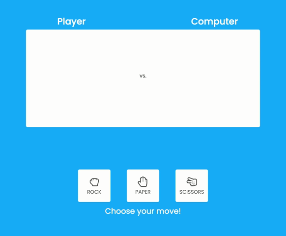

# Rock-Paper-Scissors

## Description:

This simple rock-paper-scissors game is built with HTML, CSS, Bootstrap and JavaScript. 

Once users select a move, the computer randomly generates a move and determines the winner:
- Rock defeats Scissors
- Paper defeats Rock
- Scissors defeats Paper

**Deployed Link:** https://jungjungie.github.io/Rock-Paper-Scissors/

***
## Demo:

  

***
## Contact
- **GitHub:**  https://github.com/jungjungie
- **Portfolio:**  https://jungjungie.github.io/